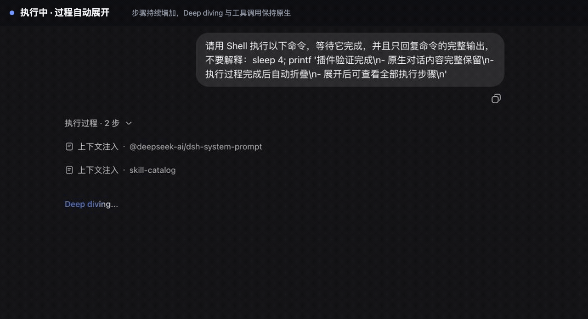

# `dsh-chat-fold`

给 stock DSH“对话”视图增加逐轮执行折叠能力的可选 Web 插件，固定兼容
stock DSH `0.1.0-rc.8`。

安装后不会新增“折叠对话”标签，也不会注册第二个“对话”标签；插件只在原有
Chat 条目上原位包一层。历史分页、滚动、文件打开、pending steering 和
`Deep diving...` 仍由 rc.8 原生 Chat 组件负责；
插件只把每轮执行节点组合为“执行过程 · N 步”。执行时自动展开，执行完成后
自动收起。再次展开时，Context、Think、Tool、命令、Goal、Workflow 和 turn-tail
仍使用已经注册的原生组件；其中执行项保持默认内层折叠状态，用户消息、最终回答
和原生 turn-tail 位于执行组外。



GIF 由 stock DSH `0.1.0-rc.8` 的真实录屏重新编排节奏而成：执行过程中保持展开，
完成后自动收起，手动重新展开时，原生内层折叠项仍保持默认收起状态。

这是有意采用的 rc.8 短期方案。因为 rc.8 没有公开拦截已注册 Chat 条目的正式
接口，插件会临时替换该条目的组件和 inject 函数，但原有 id、标签、store、
子槽所有权和原生 `renderSlot` 绑定都不变。若插件包装层自身异常，会使用保留的
原生 props 直接渲染原始 Chat 组件。

## 安装

```bash
dsh plugin --profile web add dsh-chat-fold@next
```

重启 Web 进程并刷新浏览器后生效。预发布版本使用 npm 的 `next` dist-tag。

## 卸载

```bash
dsh plugin --profile web remove dsh-chat-fold
```

重启 Web 进程并刷新浏览器后生效。卸载插件后会恢复原始“对话”实现。
